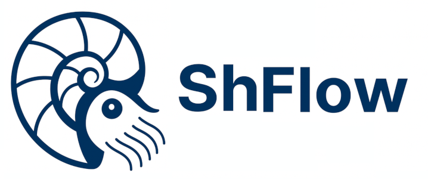

# ⚙️ ShFlow — Automatización declarativa en Shell

**ShFlow** es una herramienta modular, trazable y extensible para ejecutar tareas en sistemas Linux mediante playbooks YAML. 

Diseñada para administradores, auditores y entusiastas del shell, ShFlow combina simplicidad declarativa con control quirúrgico.

- 🔍 Inventario YAML con grupos, etiquetas y metadatos
- 🧩 Módulos reutilizables con argumentos dinámicos
- 📦 Ejecución distribuida por host o grupo
- 🧠 Depuración avanzada con trazas limpias (`--debug`)
- 📚 Documentación bilingüe y estructura escalable

## 📚 Documentación

La documentación completa está disponible en la web [shflow.tech](https://shflow.tech).  
Incluye índice técnico, changelogs, ejemplos, y guía de módulos.

## 📜 Licencia

Este proyecto está licenciado bajo [GPLv3](LICENSE).  
Autor: **Luis GuLo** — 2025

---

# ⚙️ ShFlow — Declarative Shell Automation

**ShFlow** is a modular, traceable and extensible tool for executing tasks on Linux systems using YAML playbooks. 

Built for sysadmins, auditors and shell enthusiasts, ShFlow blends declarative simplicity with surgical control.

- 🔍 YAML inventory with groups, tags and metadata
- 🧩 Reusable modules with dynamic arguments
- 📦 Distributed execution by host or group
- 🧠 Advanced debugging with clean traces (`--debug`)
- 📚 Bilingual documentation and scalable structure

## 📚 Documentation

Full documentation is available in [shflow.tech](https://shflow.tech).  
Includes technical index, changelogs, examples, and module guide.

## 📜 License

This project is licensed under [GPLv3](LICENSE).  
Author: **Luis GuLo** — 2025

